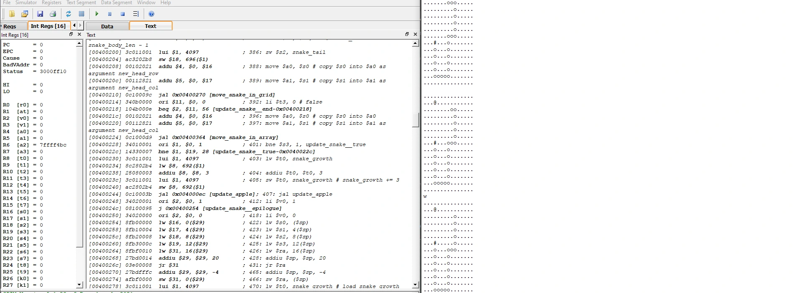

# Snake in MIPS 🐍

Implementation of the classic video game Snake in low level MIPS Assembly Language 🕹️

## Getting Started

These instructions will get you a copy of the project up and running on your local machine for development and testing purposes. See below for prerequisite libraries and notes on how to deploy the project on a live system.

`git clone https://github.com/mahirahman/Snake.git`

To get a feel for this game, try it out in QtSpim:

1. Open [QtSpim]([http://spimsimulator.sourceforge.net](https://sourceforge.net/projects/spimsimulator)) (Or your preferred MIPS emulator)
2. Click 'File' on the top left
3. Click 'Reinitialize and Load File' from the drop-down menu
4. Find snake.s on your computer and open it
5. Click the green play button
6. Enter command w|a|s|d into the console that pops up

```
.@.............
...............
...............
...............
...............
...............
...............
....ooo#.......
...............
...............
...............
...............
...............
...............
...............
```



## Notes

The starting state of a game to the right, where you can see all the key parts of the game. Snake is played on a 15×15 grid. The snake is made up of a head (#), and a number of body segments (o), and can move around the grid.

When the user enters one of w, a, s, or d, the snake will move one step on the grid either north, west, south, or east, respectively. The snake won't move if the requested direction is where the first non-head segment is.

Also on the grid: apples! Snakes like apples *[citation needed]* so, if the snake's head moves over an apple (denoted @), the snake consumes it, and gains three segments over the next three moves. If there's no apple on the grid, a new one is added in a random empty cell.

The game ends only when either the snake falls off one of the edges of the board, or the snake runs into its own body as the snake's length increases, not falling off the board or running into itself become increasingly tricky!

## Built With

* [MIPS Assembly Language (MAL)](https://www.cse.unsw.edu.au/~cs1521/18s2/notes/C/notes.html) - Assembly Language
* [QtSpim](http://spimsimulator.sourceforge.net) - MIPS Simulator

## License

* [General Public License v2.0](https://github.com/mahirahman/snake/blob/master/LICENSE)

## Authors

* **Mahi Rahman**
